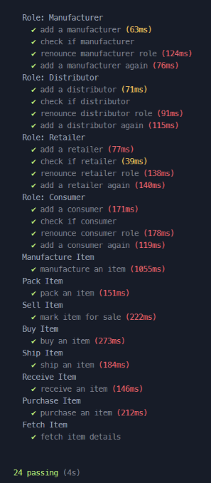

# Installation
1. Clone repository: ```git clone https://github.com/ByWaleed/Decentralized-Supply-Chain.git```

## Backend
1. Install packages: ```npm install```
2. Install truffle: ```npm install -g truffle```
3. Start local blockchain: ```truffle develop```. This shows ten accounts (and their private keys) that can be used when interacting with the blockchain.
4. Compile and migrate smart contracts on the local blockahin by running: ```migrate``` in the truffle develop prompt.

## Frontend
1. Change into app/src directory: ```cd app/src```
2. Install npm packages: ```npm install```
3. Start local server: ```npm run start```

To interact with the blockcahin, a digital wallet is required with a connected account.

Digital wallets can be installed as brower extensions such as [MetaMask](https://chrome.google.com/webstore/detail/metamask/nkbihfbeogaeaoehlefnkodbefgpgknn).

Step 3 of the [backend installation](#backend) provides 10 accounts. Import an account in the wallet and then connected with the site to start interacting with the blockchain.


# Usage

There are two ways to interact with the blockchain: CLI and Web frontend.

## CLI

First is through the CLI, which grants direct access to the CLI.

A detailed guide on interaction with truffle contracts is available [here](https://trufflesuite.com/docs/truffle/getting-started/interacting-with-your-contracts/#introducing-abstractions). Here are few steps to help you get started:

1. Start a local blockchain and the truffle develop prompt: ```truffle develop```. Commands listed below should be executed in the truffle develop prompt
2. Compile and deploy smart contract on the local blockcahin by running: ```migrate```
3. Create an instance of the Smart Contract: ```let instance = await Supplychain.deployed()```
4. Assign manufacturer role to account 1: ```instance.addManufacturer(accounts[0])```. Run ```instance.isManufacturer(accounts[0])``` to confirm assigned role
5. Assign distributor role to account 2: ```instance.addManufacturer(accounts[1])```. Run ```instance.isManufacturer(accounts[1])``` to confirm assigned role
6. Assign retailer role to account 3: ```instance.addManufacturer(accounts[2])```. Run ```instance.isManufacturer(accounts[2])``` to confirm assigned role
7. Assign consumer role to account 4: ```instance.addManufacturer(accounts[3])```. Run ```instance.isManufacturer(accounts[3])``` to confirm assigned role
8. [Manufacturer] Manufacture an item: ```instance.manufactureItem(1, "Item name", "Item description", 500, { from: accounts[0] })```. Parameters are: SKU, name, description, price (int ETH) and optional parameter to associate user with the transaction
9. [Manufacturer] Pack the item: ```instance.packItem(1, { from: accounts[0] })```
10. [Manufacturer] Mark the item for sale: ```instance.sellItem(1, 500, { from: accounts[0] })```
11. [Distributer] Buy the item: ```instance.buyItem(1, { from: accounts[1] })```
12. [Distributer] Ship the item: ```instance.shipItem(1, { from: accounts[1] })```
13. [Retailer] Confirm receiving item: ```instance.receiveItem(1, { from: accounts[2] })```
14. [Consumer] Purchase the item: ```instance.purchaseItem(1, { from: accounts[3] })```
15. Confirm item history: ```instance.fetchItem(1)```
16. List accounts addresse: ```accounts```

## Web Interface

Second is through the web frontend, which handles the API calls to the contracts & blockchain.

Follow [frontend installation](#frontend) to start the local server.

# Testing

Simply run ```truffle test```.

Prerequisites:
1. Clone repository: ```git clone https://github.com/ByWaleed/Decentralized-Supply-Chain.git```
2. Install packages: ```npm install```
3. Install truffle: ```npm install -g truffle```

Output:


